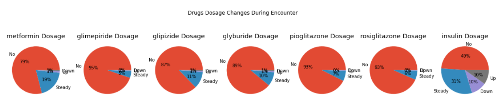
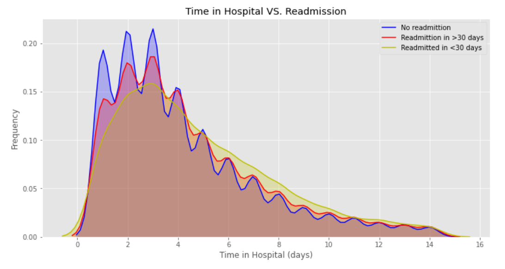

### Diabetes-Patient-Readmission-Classification
develop a pattern recognition system that operates on a given real- world dataset. 

### Introduction
The goal of this project is to develop a pattern recognition system that operates on a given real-
world dataset.

### Dataset
Our dataset is: Diabetes 130-US hospitals for years 1999-2008 Data Set.

Source:
https://archive.ics.uci.edu/ml/datasets/Diabetes+130-US+hospitals+for+years+1999-800

The dataset represents 10 years (1999-2008) of clinical care at 130 US hospitals and integrated
delivery networks. It includes over 50 features representing patient and hospital outcomes. 

The target labels, indicating: 
* “<30” if the patient was readmitted in less than 30 days 
* “>30” if the patient was readmitted in more than 30 days 
* “No” for no record of readmission.

This problem is a 3-class classification problem.

### Project Goal
The main goal of this project is to design a machine learning classification system, that is able to predict the readmission of a diabetes patient, based on the patient's medical history information.

### Conclusion
We have acheived the best prediction performance using Gradient Boost classifier.
• F1 Score (micro): 0.615
• F1 Score (macro): 0.363
The main reasons for not acheiving a high classification performance is the fact that our labels are not palnced thoughout
the dataset, where 1 label (No readmission) accounts for over 60% of the data points, while another
label (Readmitted in < 30 days) accounts for only ~8%. Another reason for low performance is
that our target has very low correlation with all of our predectors.

### Future Work 
In the future, we can try the following to improve the performance of our classifier:
1. combine (readmitted in < 30 days) and (readmitted in > 30 days) into one feature, and turn
the problem in to binary classification problem (readmitted vs not readmmited) which is going to
result in a better palanced label classes. 2. We can try selecting a subset of feature, with higher
classification importance according to our classifier, and just using those in training.

### References
• https://archive.ics.uci.edu/ml/datasets/Diabetes+130-US+hospitals+for+years+1999-2008
• https://www.hindawi.com/journals/bmri/2014/781670/
• https://www.analyticsvidhya.com/blog/2016/02/complete-guide-parameter-tuning-gradient-boosting-gbm-python
